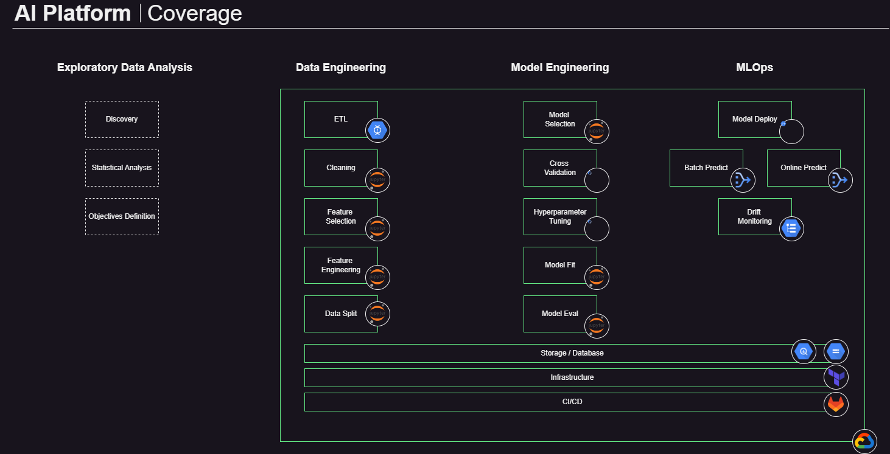

# Plataforma MLOps
Plataforma de desenvolvimento de soluções de IA/ML com suporte sobre serviços do Google no GCP.

## Arquitetura Geral
Arquitetura alto nível, com representação dos principais componentes que habilitam as capacidades da plataforma.

## Esteiras de Operação
A plataforma suporta 3 cenários de operação comuns.
A experimentação é o cenário onde deseja-se explorar as features e algoritmos proponentes a atingir o objetivo explorado.
O treinamento é o cenário onde uma sequência de etapas de wrangling e fit são encadeadas para serem executadas em serviços de computação gerenciados na nuvem, com seu resultado podendo ser implementado automaticamente em repositórios versionados, conforme forem atingidos progressos incrementais.
A inferência é o cenário onde utiliza-se o modelo previamente treinado sobre novos dados, resultando em dados de inteligência que complementam os dados originais, para concretizar os objetivos almejados.

Cada etapa, sob seu respectivo cenário, é suportado por lógicas de MLOps que eliminam trabalhos repetitivos e permitem focar exclusivamente nas competências de dados.

## Cobertura
Elementos de data science cobertos pela plataforma, agilizando os trabalhos de experimentação, criação e implementação dos modelos gerados.
Novos elementos podem ser incluídos conforme a plataforma evolui.

## Como Operar?
### Requisitos
- Req 1
- Req 2
- Req 3
### Experimentação
Instrução...
### Produção de Modelos
Instrução...
### Operação dos Modelos (intefência internalizada)
Instrução
### Operação dos Modelos (endpoint serving)
Instrução